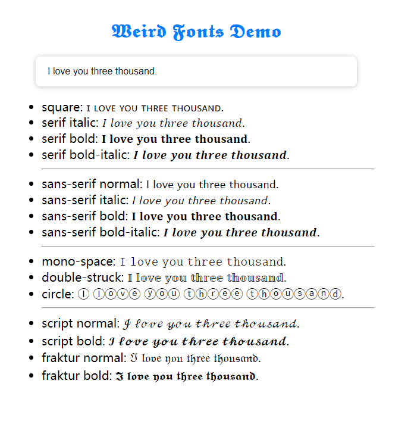

# 𝑾𝒆𝒊𝒓𝒅 𝑭𝒐𝒏𝒕𝒔
𝑨 𝑱𝒂𝒗𝒂𝑺𝒄𝒓𝒊𝒑𝒕 𝒑𝒂𝒄𝒌𝒂𝒈𝒆 𝒕𝒉𝒂𝒕 𝒕𝒖𝒓𝒏 𝒂𝒍𝒑𝒉𝒂𝒏𝒖𝒎𝒆𝒓𝒊𝒄 𝒄𝒉𝒂𝒓𝒂𝒄𝒕𝒆𝒓𝒔 𝒊𝒏𝒕𝒐 𝒘𝒆𝒊𝒓𝒅 𝒇𝒐𝒏𝒕 𝒔𝒕𝒚𝒍𝒆.

## 𝑺𝒄𝒓𝒆𝒆𝒏𝒔𝒉𝒐𝒕

<div align="center"></div> 

You can play with this [demo](https://beizhedenglong.github.io/weird-fonts). 


## 𝑰𝒏𝒔𝒕𝒂𝒍𝒍𝒂𝒕𝒊𝒐𝒏
```  
npm install weird-fonts --save  
```  

## 𝑼𝒔𝒂𝒈𝒆
```js 
import { serif } from "weird-fonts" 

serif("I love you three thousand.", { fontStyle: "bold-italic" }) // 𝑰 𝒍𝒐𝒗𝒆 𝒚𝒐𝒖 𝒕𝒉𝒓𝒆𝒆 𝒕𝒉𝒐𝒖𝒔𝒂𝒏𝒅.

```